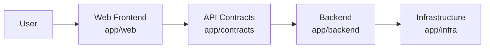

# Architecture Snapshot

## System Overview

This project is initialized from the `agentic-project-template` and assembled with official architecture starters.

Installed starter repositories:

- `agentic-clean-backend` in `app/backend`
- `agentic-react-spa` in `app/web`
- `agentic-api-contracts-api` in `app/contracts`
- `agentic-postgres-dev` in `app/infra`

The project follows the feature lifecycle and governance flow defined in the template documentation.

## Backend Layer

The backend runtime is provided by `agentic-clean-backend` and installed in `app/backend`.
This layer owns domain and application logic, plus backend-facing adapters and APIs.

## Frontend Layer

The web frontend is provided by `agentic-react-spa` and installed in `app/web`.
This layer owns the browser client and UI workflows.

## Contracts Layer

The API contracts layer is provided by `agentic-api-contracts-api` and installed in `app/contracts`.
This layer defines integration contracts between client and backend.

## Infrastructure Layer

The development infrastructure is provided by `agentic-postgres-dev` and installed in `app/infra`.
This layer is optional but currently enabled for local data services.

## High-Level Architecture Diagram

## Notes

- Primary architecture decision: `docs/adr/ADR-001-architecture-strategy.md`
- Starter ownership and boundaries follow starter instructions under `.github/instructions/starters/`
